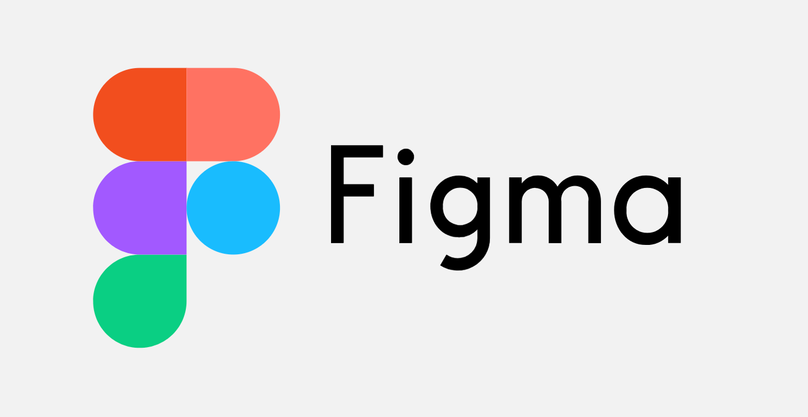
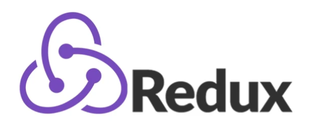

# Hi there👋, i am Kirill

🔭 Currently working on improving my skills in React.js
 

🌱 I am using:
 
 
     
 
 

🤔 Learning: 
 

⚡ Next step: get a job offer!
 

📫 How to find me: lazukinki@gmail.com

<!--
**Cyrreal/Cyrreal** is a ✨ _special_ ✨ repository because its `README.md` (this file) appears on your GitHub profile.

Here are some ideas to get you started:

- 🔭 I’m currently working on ...
- 🌱 I’m currently learning ...
- 👯 I’m looking to collaborate on ...
- 🤔 I’m looking for help with ...
- 💬 Ask me about ...
- 📫 How to reach me: ...
- 😄 Pronouns: ...
- ⚡ Fun fact: ...
-->
